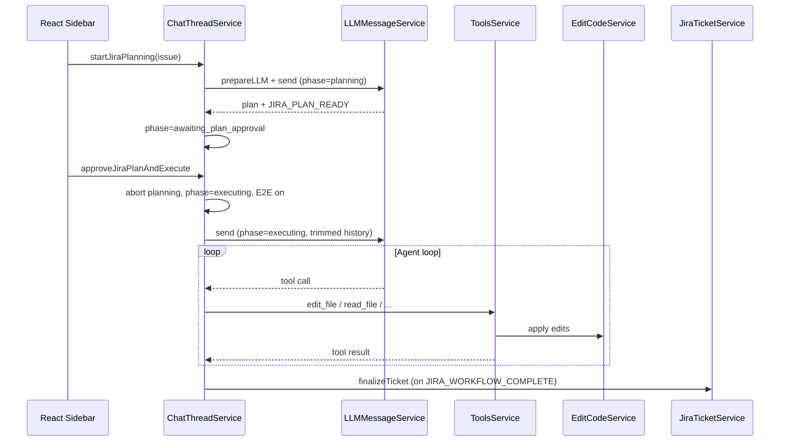

# Agentic Workflow Architecture

This document describes the **Agentic** workbench contribution: an IDE-embedded agent layer for chat-driven coding, tool execution, inline diffs, checkpoints, MCP integrations, and **Jira-driven plan → approve → execute** workflows. The implementation lives in this repository at:

**`void/src/vs/workbench/contrib/agentic/`**

The path `contributing/agentic/` is the **documentation root** for that module. There is no separate npm package here; Agentic is compiled and shipped as part of the Agentic editor (VS Code fork) under `void/`.

---

## 2. Executive Summary

### What this module does

| Responsibility | Description |
|----------------|-------------|
| **Chat & agent loop** | Persists threads, streams LLM responses, parses XML tool calls, runs tools in a loop until the model stops or the user aborts. |
| **Tool execution** | Built-in tools (read/search/edit/terminal) plus optional **MCP** tools (e.g. Atlassian Jira). |
| **Inline edits** | `edit_file` / `rewrite_file` apply search/replace or full rewrites with diff zones in the editor. |
| **Jira workflow** | List tickets → plan (read-only) → human approval → execute (edits + auto-approve) → Jira comment/transition. |
| **UI** | React bundles mounted into workbench view panes (sidebar, settings, command bar, quick edit). |

### Problem it solves

Developers need a **single surface** inside the IDE to: understand a ticket, explore the repo, produce an implementation plan, approve it, apply code changes with auditability (checkpoints/diffs), and optionally sync status back to Jira—without a separate web app or LangGraph server.

### How layers connect

```
React UI (sidebar, Jira panel)
    → IChatThreadService (threads, stream state, agent loop)
        → IConvertToLLMMessageService (system prompt, history trim)
        → ILLMMessageService → Electron main (providers)
        → IToolsService / IMCPService (tool execution)
        → IEditCodeService (diffs, apply, checkpoints)
```

### Runtime model

- **Primary:** Local **Electron desktop IDE** (renderer workbench + main process for LLM/MCP).
- **Not:** A standalone HTTP API server, LangGraph service, or cloud-only backend for the core loop.
- **Read first:** `browser/chatThreadService.ts` → `browser/convertToLLMMessageService.ts` → `common/prompt/prompts.ts` → `browser/toolsService.ts` → `browser/jiraTicketService.ts` → `browser/react/src/jira-workflow/`.

---

## 3. Folder Structure

```
void/src/vs/workbench/contrib/agentic/
├── README.md                          # (optional copy) pointer to contributing/agentic
├── browser/                           # Workbench (renderer) services & UI hosts
│   ├── agentic.contribution.ts        # Module entry: imports all registrations
│   ├── chatThreadService.ts           # ★ Agent loop, threads, Jira workflow state machine
│   ├── convertToLLMMessageService.ts  # ★ Chat → LLM messages + system prompt
│   ├── toolsService.ts                # ★ Built-in tool validate/call/stringify
│   ├── editCodeService.ts             # ★ Diffs, apply, streaming edits
│   ├── jiraTicketService.ts           # ★ Jira via Atlassian MCP
│   ├── agenticCommandBarService.ts    # Per-file diff navigation in editor
│   ├── sidebarPane.ts                 # Mounts React sidebar bundle
│   ├── sidebarActions.ts              # Ctrl+L, thread actions
│   ├── terminalToolService.ts         # Shell / persistent terminals
│   ├── react/                         # React source + build
│   │   ├── build.js                   # tsup + scope-tailwind + sync to out/
│   │   ├── src/                       # Authoring source (edit here)
│   │   ├── src2/                      # Generated: prefixified Tailwind (do not hand-edit)
│   │   └── out/                       # Bundled ESM (loaded by sidebarPane)
│   └── media/agentic.css
├── common/                            # Shared types & services (renderer + main)
│   ├── prompt/prompts.ts              # ★ System prompts, tool XML, chat modes
│   ├── chatThreadServiceTypes.ts      # ChatMessage, ToolMessage, CheckpointEntry
│   ├── jiraTypes.ts                 # Jira workflow phases & markers
│   ├── toolsServiceTypes.ts           # Tool param/result types, approval map
│   ├── mcpService.ts                # MCP client (IPC to main)
│   ├── sendLLMMessageService.ts       # LLM IPC facade
│   └── agenticSettingsService.ts    # Models, chat mode, auto-approve, Jira E2E flag
└── electron-main/                     # Main process
    ├── llmMessage/sendLLMMessage*.ts  # Provider calls (OpenAI, Anthropic, Ollama, …)
    ├── mcpChannel.ts                  # MCP server lifecycle
    └── sendLLMMessageChannel.ts       # IPC channel registration
```

**Build artifacts (do not edit):** `browser/react/out/`, `browser/react/src2/`, and `void/out/vs/workbench/contrib/agentic/...` after compile.

**Not present in this folder:** `tests/` dedicated to agentic, LangGraph graphs, AST/knowledge-graph indexers, GitHub PR workflow automation.

---

## 4. High-Level Architecture

### 1. UI / Interaction Layer

| Files | Role |
|-------|------|
| `browser/react/src/sidebar-tsx/*` | Main chat + Jira workflow panel |
| `browser/react/src/jira-workflow/*` | Two-column Jira UI, plan/files/log tabs |
| `browser/sidebarPane.ts` | `mountSidebar()` from `react/out/sidebar-tsx/index.js` |
| `browser/react/src/util/services.tsx` | Bridges VS Code services → React hooks |

**In:** User clicks, ticket selection, approve/reject.  
**Out:** Calls `IChatThreadService`, `IJiraTicketService` via accessor.

### 2. Chat Thread / Request Layer

| Files | Role |
|-------|------|
| `browser/chatThreadService.ts` | Thread storage, `_runChatAgent`, tool loop |
| `common/chatThreadServiceTypes.ts` | Message union types |

**In:** User message string, thread id.  
**Out:** Appended `ChatMessage`s, `streamState` (LLM/tool/awaiting_user).

### 3. Context Collection Layer

| Files | Role |
|-------|------|
| `common/directoryStrService.ts` | Workspace directory tree string for system prompt |
| `browser/convertToLLMMessageService.ts` | Open files, active URI, selections in user messages |
| `common/prompt/prompts.ts` | `chat_userMessageContent`, workspace metadata |

**In:** Workspace folders, opened editors.  
**Out:** System message sections (`directoryStr`, `openedURIs`, linked Jira block).

**Note:** `browser/contextGatheringService.ts` exists but is **not registered** in `agentic.contribution.ts` (commented out).

### 4. Planning Layer (Jira-specific)

| Files | Role |
|-------|------|
| `browser/jiraTicketService.ts` | `buildPlanTicketUserMessage` |
| `common/prompt/prompts.ts` | `jiraWorkflowPhase === 'planning'` → read-only tools |
| `chatThreadService.ts` | `startJiraPlanning`, `_handleJiraWorkflowAfterAssistantMessage` |

**In:** `LinkedJiraIssue`, requirements text.  
**Out:** Plan markdown, `[[JIRA_PLAN_READY]]`, phase `awaiting_plan_approval`.

### 5. Agent Orchestration Layer

| Files | Role |
|-------|------|
| `chatThreadService.ts` | `while (shouldSendAnotherMessage)` agent loop |
| `common/sendLLMMessageService.ts` | Streaming LLM IPC |
| `electron-main/llmMessage/*` | Provider implementations |

**In:** Prepared messages + model selection.  
**Out:** Assistant text, optional single XML tool call per turn.

**LangGraph:** **Not implemented.** Orchestration is a **hand-written loop** in `_runChatAgent` (request-driven, one tool per assistant turn).

### 6. Tool Execution Layer

| Files | Role |
|-------|------|
| `browser/toolsService.ts` | Built-in tools |
| `common/mcpService.ts` + `electron-main/mcpChannel.ts` | MCP tools |
| `chatThreadService.ts` | `_runToolCall`, approval gate |

### 7. Repository / AST / Knowledge Graph Layer

| Status | Detail |
|--------|--------|
| **Directory tree** | Implemented via `get_dir_tree`, `ls_dir`, `search_*` |
| **AST / knowledge graph** | **Not implemented** in this module |
| **Semantic index** | **Not implemented** |

### 8. Checkpoint and Approval Layer

| Files | Role |
|-------|------|
| `chatThreadService.ts` | `_addCheckpoint`, `_addToolEditCheckpoint`, `jumpToCheckpointBeforeMessageIdx` |
| `common/editCodeServiceTypes.ts` | `AgenticFileSnapshot` in checkpoints |
| `common/toolsServiceTypes.ts` | `approvalTypeOfBuiltinToolName` |
| `agenticSettingsService.ts` | `isJiraE2EThread`, `autoApprove` |

### 9. Build and Run Layer

| Files | Role |
|-------|------|
| `browser/react/build.js` | React bundle + sync to `void/out/.../react/out` |
| `void/package.json` | `npm run buildreact` |
| `void/build/lib/preLaunch.ts` | Dev launch: ensure React + TypeScript compile |
| `void/scripts/code.sh` | Start dev Agentic |

### 10. Observability / Logging Layer

| Files | Role |
|-------|------|
| `common/metricsService.ts` | `capture('Agent Loop Done', …)` |
| `chatThreadService.ts` | Stream state drives UI |
| React execution log | `jiraWorkflowUtils.buildExecutionLog` (derived from thread messages) |

---

## 5. End-to-End Workflow

### A. General chat (agent mode)

1. User opens sidebar (`sidebarPane` → `Sidebar.tsx`).
2. User types message → `addUserMessageAndStreamResponse`.
3. `_runChatAgent` loop starts.
4. `prepareLLMChatMessages` builds system + history.
5. `sendLLMMessage` streams tokens; UI updates `streamState.isRunning === 'LLM'`.
6. If model returns tool XML → `_runToolCall` → tool result appended → loop continues.
7. If no tool → loop ends; user checkpoint added.

### B. Jira plan → approve → execute

| Step | Action | Primary code |
|------|--------|----------------|
| 1 | User opens Jira workflow in sidebar | `JiraWorkflowPage.tsx`, `useJiraWorkflow.ts` |
| 2 | Lists issues via MCP | `jiraTicketService.listMyIssues` |
| 3 | Select ticket | `switchToJiraIssue`, `fetchIssue`, `setLinkedJiraIssue` |
| 4 | **Plan** | `startJiraPlanning` → phase `planning`, read-only tools |
| 5 | Agent explores repo (`read_file`, search, …) | `toolsService`, `availableTools(..., 'planning')` |
| 6 | Agent outputs plan + `[[JIRA_PLAN_READY]]` | `_handleJiraWorkflowAfterAssistantMessage` → `awaiting_plan_approval` |
| 7 | User reviews plan in UI | `WorkspaceTabs.tsx` plan tab |
| 8 | **Approve & Run** | `approveJiraPlanAndExecute` |
| 9 | Abort stale planning stream **first** | `approveJiraPlanAndExecute` (critical ordering) |
| 10 | Phase `executing`, `setJiraE2EThread` | auto-approve edits |
| 11 | Execute user message added | `buildExecuteAfterApprovalMessage` |
| 12 | LLM history trimmed from execute message | `chatMessagesForJiraExecution` in `convertToLLMMessageService.ts` |
| 13 | Agent must `edit_file` / `rewrite_file` | `prompts.ts` execution instructions |
| 14 | Checkpoints on edits | `_addToolEditCheckpoint` |
| 15 | Agent sends `[[JIRA_WORKFLOW_COMPLETE]]` | `_finalizeJiraWorkflow` |
| 16 | Jira comment + transition via MCP | `jiraTicketService.finalizeTicket` |
| 17 | Phase `completed` | `jiraWorkflow.phase` |

**Failure handling:**

| Failure | Behavior |
|---------|----------|
| No edits before complete marker | `_finalizeJiraWorkflow` blocks; `jiraFinalizeStatus: 'error'` |
| Run ends without complete marker | No Jira finalize (`_maybeFinalizeJiraOnRunEnd`) |
| User abort during execute | `abortRunning` reverts to `awaiting_plan_approval`, clears Jira E2E |
| MCP / Jira unavailable | `jiraTicketService` throws; UI shows error |
| Tool approval denied | Loop pauses `awaiting_user` (unless auto-approve) |

---

## 6. File-by-File Explanation

Below, paths are relative to **`void/src/vs/workbench/contrib/agentic/`**.

---

### `browser/agentic.contribution.ts`

**Purpose:** Single import side-effect module registered from `workbench.common.main.ts`.

**Key exports:** None (imports register services).

**Connections:** Loads edit, sidebar, tools, chat, Jira, settings, LLM, metrics.

**Extension:** Add `import './yourService.js'` here to register new workbench contributions.

---

### `browser/chatThreadService.ts` ★

**Purpose:** Central orchestrator for chat threads and the agent loop.

**Key exports / types:**

- `IChatThreadService` — public API
- `ThreadsState`, `ThreadStreamState`, `ThreadType`
- Methods: `addUserMessageAndStreamResponse`, `startJiraPlanning`, `approveJiraPlanAndExecute`, `approveLatestToolRequest`, `abortRunning`, `switchToJiraIssue`, …

**Workflow connections:**

- Called by React via `services.tsx` hooks
- Calls `_convertToLLMMessagesService.prepareLLMChatMessages`
- Calls `_llmMessageService.sendLLMMessage`
- Calls `_runToolCall` → `_toolsService` / `_mcpService`
- Jira: `_handleJiraWorkflowAfterAssistantMessage`, `_finalizeJiraWorkflow`, `_maybeFinalizeJiraOnRunEnd`

**Inputs:** `threadId`, user message, model selection from settings.

**Outputs:** Updated `messages[]`, `thread.state.jiraWorkflow`, `streamState`, file edits via tools.

**Important details:**

- One tool call per assistant message (enforced in prompts).
- `approveJiraPlanAndExecute` must abort planning **before** setting `executing` (avoids `abortRunning` rollback bug).
- Edit auto-approve: `isJiraE2EThread(threadId) || jiraWorkflow.phase === 'executing'`.

---

### `browser/convertToLLMMessageService.ts` ★

**Purpose:** Converts `ChatMessage[]` + settings into provider-specific LLM payloads.

**Key exports:** `IConvertToLLMMessageService.prepareLLMChatMessages`

**Connections:** Used only from `chatThreadService._runChatAgent`.

**Inputs:** `chatMessages`, `chatMode`, `linkedJiraIssue`, `jiraWorkflowPhase`.

**Outputs:** `{ messages, separateSystemMessage }`.

**Important details:**

- `chatMessagesForJiraExecution()` slices history from last `JIRA_EXECUTE_USER_PREFIX` user message when phase is `executing`.
- Omits full directory tree during Jira planning/executing (tools used instead).

---

### `browser/toolsService.ts` ★

**Purpose:** Validates and executes all built-in tools.

**Key exports:** `IToolsService` — `validateParams`, `callTool`, `stringOfResult`.

**Connections:** `chatThreadService._runToolCall`; definitions in `common/prompt/prompts.ts`.

**Side effects:** `read_file` → `revealFileInEditor`; edits → `editCodeService.instantlyApplySearchReplaceBlocks` / `instantlyRewriteFile`.

---

### `browser/editCodeService.ts` ★

**Purpose:** Diff zones, streaming applies, fast apply (search/replace blocks), checkpoint snapshots.

**Key exports:** `IEditCodeService` (via `editCodeServiceInterface.ts`).

**Connections:** Tools, command bar, checkpoint restore in `chatThreadService`.

**Important:** `_shouldAutoAcceptLLMChanges()` true when `isAnyJiraE2EActive()` or global `autoAcceptLLMChanges`.

---

### `browser/jiraTicketService.ts` ★

**Purpose:** Jira operations exclusively through **Atlassian MCP** (`ATLASSIAN_MCP_SERVER_NAME = 'atlassian'`).

**Key methods:** `listMyIssues`, `fetchIssue`, `buildPlanTicketUserMessage`, `buildExecuteAfterApprovalMessage`, `finalizeTicket`.

**Inputs:** Issue keys, plan markdown, comment body.

**Outputs:** `JiraTicketSummary[]`, `LinkedJiraIssue`, `{ success, message }` from finalize.

**Env:** No hard-coded API keys in this file; MCP server config is user-supplied in `mcp.json` (see MCP section).

---

### `browser/agenticCommandBarService.ts`

**Purpose:** Tracks URIs with active diff zones; prev/next diff navigation in editor widgets.

**Connections:** `react/.../AgenticCommandBar.tsx`, `useCommandBarState` hook.

---

### `browser/sidebarPane.ts` / `sidebarActions.ts`

**Purpose:** Registers Agentic sidebar view container; mounts React; keybindings (e.g. Ctrl+L).

**Connections:** `mountSidebar` from compiled bundle under `react/out/sidebar-tsx/`.

---

### `browser/terminalToolService.ts`

**Purpose:** `run_command`, persistent terminals for agent tools.

---

### `common/prompt/prompts.ts` ★

**Purpose:** System prompts, builtin tool XML schemas, `availableTools()`, chat modes.

**Key exports:** `chat_systemMessage`, `builtinTools`, `availableTools`, `jiraPlanningBuiltinTools`.

**Jira behavior:**

- `planning` → tools filtered to read/search/list/lint only.
- `executing` → full agent tools + strong edit requirements.
- Markers: `JIRA_PLAN_READY_MARKER`, `JIRA_WORKFLOW_COMPLETE_MARKER`.

---

### `common/jiraTypes.ts` / `common/jiraTextUtils.ts`

**Purpose:** Workflow state types, markers, UI text helpers (`formatRequirementsForUI`, `stripJiraWorkflowMarkers`).

---

### `common/chatThreadServiceTypes.ts`

**Purpose:** `ChatMessage`, `ToolMessage`, `CheckpointEntry` — persisted thread shape.

---

### `common/toolsServiceTypes.ts`

**Purpose:** `BuiltinToolCallParams`, `BuiltinToolResultType`, `approvalTypeOfBuiltinToolName`.

---

### `common/mcpService.ts` + `electron-main/mcpChannel.ts`

**Purpose:** Load MCP servers from user config; expose tools to prompts; IPC tool calls to main process.

**Config file:** `mcp.json` in user data (opened via `revealMCPConfigFile()`).

---

### `common/sendLLMMessageService.ts` + `electron-main/llmMessage/*`

**Purpose:** Renderer ↔ main IPC for streaming completions and model lists.

**Channel:** `agentic-channel-llmMessage`.

---

### `common/agenticSettingsService.ts`

**Purpose:** Provider API keys, model picks, `chatMode` (`agent` | `gather` | `normal`), `autoApprove`, **`setJiraE2EThread` / `isJiraE2EThread`**.

**Storage:** Persisted settings (not in-repo env files).

---

### React: `browser/react/src/jira-workflow/`

| File | Purpose |
|------|---------|
| `JiraWorkflowPage.tsx` | Layout: issue list + workspace |
| `useJiraWorkflow.ts` | State hook: issues, plan, execution log, actions |
| `jiraWorkflowUtils.ts` | `extractJiraExecutionFacts`, `buildExecutionLog`, plan parsing |
| `WorkspaceTabs.tsx` | Requirement / Plan / Files / Log tabs |
| `IssueListPanel.tsx` | Ticket list + scope filters |
| `SelectedIssueWorkspace.tsx` | Tabs container for selected issue |
| `WorkflowHeader.tsx` | Status, plan/run actions |
| `CheckpointStrip.tsx` | Checkpoint restore UI |

**Build:** Edit `react/src/` only; run `npm run buildreact` from `void/`.

---

### React: `browser/react/src/sidebar-tsx/`

| File | Purpose |
|------|---------|
| `Sidebar.tsx` | Jira slot + chat layout |
| `SidebarChat.tsx` | Message list, tool bubbles, streaming |
| `JiraTicketPanel.tsx` | Re-exports `JiraWorkflowPage` |
| `util/services.tsx` | `_registerServices`, React hooks for all agentic services |

---

### `electron-main/` (summary)

| File | Purpose |
|------|---------|
| `sendLLMMessageChannel.ts` | IPC wiring |
| `llmMessage/sendLLMMessage.impl.ts` | OpenAI-compatible, Anthropic, Gemini, Ollama, etc. |
| `mcpChannel.ts` | Spawns MCP servers, lists tools, executes calls |
| `agenticUpdateMainService.ts` | GitHub releases check for app updates (not Jira workflow) |

---

## 7. Workflow Orchestration Details

| Question | Answer |
|----------|--------|
| How does a workflow start? | UI calls `IChatThreadService` (chat or `startJiraPlanning` / `approveJiraPlanAndExecute`). |
| Driver | **UI-driven** + **request-driven** agent loop (not CLI, not cron). |
| Planner / supervisor? | **No separate planner process.** Jira “planning” is a **prompt + tool filter** phase on the same LLM. |
| Task classification | `chatMode` + optional `jiraWorkflowPhase`. |
| State storage | In-memory thread state persisted via workbench storage (threads JSON); checkpoints in `messages[]`. |
| Retries | LLM send retries in inner `while (shouldRetryLLM)`; tool errors appended as `tool_error` messages. |
| Final summary | Assistant message + optional Jira comment via `finalizeTicket`. |

**LangGraph-style orchestration is not implemented.** There are no graph nodes, edges, or LangGraph state machines in this folder.

---

## 8. Data Flow

### Thread state (Jira)

```typescript
// common/jiraTypes.ts
type JiraWorkflowPhase = 'planning' | 'awaiting_plan_approval' | 'executing' | 'completed'

type JiraWorkflowState = {
  phase: JiraWorkflowPhase
  planMarkdown?: string
  planSummary?: string
  requirementsSummary?: string
  jiraFinalizeStatus?: 'pending' | 'success' | 'error'
  jiraFinalizeMessage?: string
}
```

### Tool message lifecycle

```typescript
// Simplified from chatThreadServiceTypes.ts
type ToolMessage = {
  role: 'tool'
  name: ToolName
  id: string
  content: string  // string shown to model
  type: 'tool_request' | 'running_now' | 'success' | 'tool_error' | 'rejected' | 'invalid_params'
  params: ToolCallParams<ToolName>
  rawParams: RawToolParamsObj
}
```

### Stream state (UI)

```typescript
// chatThreadService.ts (conceptual)
streamState[threadId] = {
  isRunning: 'LLM' | 'tool' | 'awaiting_user' | 'idle' | undefined
  llmInfo?: { displayContentSoFar, reasoningSoFar, toolCallSoFar }
  toolInfo?: { toolName, toolParams, ... }
  error?: { message, fullError }
}
```

### Checkpoint

```typescript
type CheckpointEntry = {
  role: 'checkpoint'
  type: 'user_edit' | 'tool_edit'
  agenticFileSnapshotOfURI: Record<string, AgenticFileSnapshot | undefined>
  userModifications: { agenticFileSnapshotOfURI: Record<...> }
}
```

---

## 9. Jira Workflow Integration

### Implemented (Atlassian MCP)

| Capability | Implementation |
|------------|----------------|
| List issues | `jiraTicketService.listMyIssues` — JQL / MCP search tools |
| Fetch issue | `fetchIssue` — MCP get-issue tools |
| Link to thread | `thread.state.linkedJiraIssue`, `jiraIssueKey` |
| Plan | `startJiraPlanning` + read-only tools + `[[JIRA_PLAN_READY]]` |
| Approve | UI → `approveJiraPlanAndExecute` |
| Execute | Full tools + `JIRA_EXECUTE_USER_PREFIX` message |
| Finalize | `finalizeTicket` — comment + status transition via MCP |
| UI | `browser/react/src/jira-workflow/*` |

### Required setup

1. Enable **Atlassian** MCP server in **Settings → MCP** (`mcp.json`).
2. Server name must resolve as `atlassian` (see `ATLASSIAN_MCP_SERVER_NAME`).
3. MCP tools are discovered dynamically (`_findTool` with multiple aliases).

### Not implemented

- Native Jira REST client in this folder (everything is MCP).
- GitHub Issues workflow (only app update fetch uses GitHub API in `agenticUpdateMainService.ts`).

---

## 10. Repository Intelligence Status

| Feature | Status |
|---------|--------|
| Workspace directory tree in system prompt | **Implemented** (`directoryStrService`) — omitted during Jira workflow |
| `get_dir_tree` / search tools | **Implemented** |
| AST parsing / symbol graph | **Not implemented** |
| Knowledge graph / semantic code index | **Not implemented** |
| Repo-wide embedding search | **Not implemented** |

---

## 11. Tool Execution Layer

### Built-in tools (agent mode)

| Tool | Approval | Implementer | Notes |
|------|----------|-------------|-------|
| `read_file` | No | `toolsService` | Opens file in editor |
| `ls_dir` | No | `toolsService` | Paginated listing |
| `get_dir_tree` | No | `toolsService` | Tree diagram |
| `search_pathnames_only` | No | `toolsService` | Filename search |
| `search_for_files` | No | `toolsService` | Content search |
| `search_in_file` | No | `toolsService` | Line numbers |
| `read_lint_errors` | No | `toolsService` | Marker service |
| `edit_file` | **edits** | `toolsService` + `editCodeService` | SEARCH/REPLACE blocks |
| `rewrite_file` | **edits** | `toolsService` + `editCodeService` | Full file replace |
| `create_file_or_folder` | **edits** | `toolsService` | |
| `delete_file_or_folder` | **edits** | `toolsService` | |
| `run_command` | **terminal** | `terminalToolService` | |
| `run_persistent_command` | **terminal** | `terminalToolService` | |
| `open_persistent_terminal` | **terminal** | `terminalToolService` | |
| `kill_persistent_terminal` | **terminal** | `terminalToolService` | |

### MCP tools

- Dynamic per server (e.g. Jira comment, transition).
- Approval type: `'MCP tools'` unless auto-approved.
- Defined at runtime in `mcpService.getMCPTools()`.

### Jira planning phase

Only: `read_file`, `ls_dir`, `get_dir_tree`, `search_pathnames_only`, `search_for_files`, `search_in_file`, `read_lint_errors` (`jiraPlanningBuiltinTools` in `prompts.ts`).

### Tools that do **not** exist

- Dedicated `run_tests` tool (use `run_command`).
- `query_ast_graph` / `query_knowledge_graph`.
- Built-in `fetch_jira_ticket` (use MCP + `jiraTicketService`).

---

## 12. Human Approval and Checkpointing

### Approval

| Condition | Auto-approve? |
|-----------|----------------|
| Global `autoApprove.edits` / `terminal` / MCP | Per settings |
| `isJiraE2EThread(threadId)` | Yes (during Jira execute) |
| `jiraWorkflow.phase === 'executing'` | Yes (edits; backup path) |
| Otherwise | `tool_request` → UI approve/reject in `SidebarChat` |

### Checkpoints

| Type | When | Content |
|------|------|---------|
| `user_edit` | End of agent loop / user abort | Snapshots of changed files vs last checkpoint |
| `tool_edit` | After `edit_file` / `rewrite_file` validated | Per-URI `AgenticFileSnapshot` |

**Restore:** `jumpToCheckpointBeforeMessageIdx` in `chatThreadService` (Jira UI: `onRestoreCheckpoint` in `useJiraWorkflow`).

---

## 13. Streaming and Logs

| Mechanism | Usage |
|-----------|--------|
| LLM streaming | IPC events `onText_sendLLMMessage` → updates `streamState.llmInfo` |
| Tool running | `streamState.isRunning === 'tool'` |
| React reactivity | `services.tsx` listeners on `IChatThreadService.onDidChangeState` |
| Jira execution log | **Derived** in UI from thread messages (`extractJiraExecutionFacts`) — not a separate event bus |
| Metrics | `metricsService.capture` on loop done / abort |

**No SSE/WebSocket server** — all streaming is in-process IPC (Electron).

**Debugging:**

1. Open DevTools in Agentic (Help → Toggle Developer Tools).
2. Watch chat thread messages in sidebar.
3. Verify `out/.../react/out/sidebar-tsx/index.js` timestamp after UI changes.
4. Confirm `jiraWorkflow.phase` in thread state during execute.

---

## 14. Build and Run Guide

All commands run from **`void/`** (repository root of the editor).

### Prerequisites

- Node.js + npm (see `void/package.json` engines if specified).
- `npm ci` in `void/` for dependencies.

---

### `npm run buildreact`

```bash
cd void
npm run buildreact
```

**What it does:**

1. `cd src/vs/workbench/contrib/agentic/browser/react && node build.js`
2. Runs **scope-tailwind** (`src/` → `src2/` with `@@` class prefix).
3. **tsup** bundles entry points (`sidebar-tsx`, `agentic-settings-tsx`, …) to `react/out/`.
4. **Syncs** `react/out/` → `void/out/vs/workbench/contrib/agentic/browser/react/out/` (dev app loads this path).

**When to run:** After any change under `browser/react/src/`.

---

### `node build.js --sync-only`

```bash
cd void/src/vs/workbench/contrib/agentic/browser/react
node build.js --sync-only
```

**What it does:** Copies existing `react/out` to workbench `out/` without full rebuild (used by `preLaunch` when bundle is fresh but sync is stale).

---

### `./scripts/code.sh` (dev Agentic)

```bash
cd void
./scripts/code.sh
```

**What it does:**

1. Runs `build/lib/preLaunch.js` (via npm script chain).
2. `ensureReactBuilt()` — may run `buildreact` if Jira/sidebar sources newer than bundle.
3. `ensureCompiled()` — TypeScript compile to `out/` if agentic or core outputs stale.
4. Launches Electron with extension development host.

**Use this** for testing `chatThreadService`, Jira workflow, and tool changes (not only React).

---

### Full compile (TypeScript)

```bash
cd void
npm run compile
# or watch:
npm run watch
```

Required for changes in `browser/*.ts`, `common/*.ts`, `electron-main/*.ts`.

---

### Packaged app vs dev

| Mode | Bundle source |
|------|----------------|
| Dev (`code.sh`) | `void/out/vs/workbench/contrib/agentic/...` |
| Packaged `.app` | Must be rebuilt/repackaged; can be **stale** if only `buildreact` was run |

---

### React dev notes (`browser/react/README.md`)

- External imports in React must use **`.js` extensions**.
- Keep `src/` **one folder deep** per entry for tsup externals detection.
- Edit **`src/`**, not `src2/` (generated).

---

### Lint / test

- No dedicated `npm test` script scoped to `contrib/agentic` in this folder.
- Broader repo tests: use `void` workspace scripts if documented in root `void/README.md`.
- **Lint:** follows VS Code / Agentic repo `eslint` configuration at `void` level.

---

## 15. Configuration and Environment

| Config | Location | Purpose |
|--------|----------|---------|
| LLM provider keys | Agentic Settings UI → `agenticSettingsService` | OpenAI, Anthropic, Ollama, etc. |
| `mcp.json` | User data dir (via MCP settings) | Atlassian/Jira MCP server |
| `chatMode` | Settings | `agent` / `gather` / `normal` |
| `autoApprove.*` | Settings | Skip approval for edits/terminal/MCP |
| Product branding | `void/product.json` | App name “Agentic” |

**No `.env` file is required inside `contrib/agentic`** for core operation; MCP servers may use env vars in their server definitions (passed in `mcpChannel.ts` via `...process.env`).

---

## 16. Chat Modes

| Mode | Tools | Typical use |
|------|-------|-------------|
| `agent` | Full builtin + MCP (except planning filter) | Default for Jira execute |
| `gather` | Read-only builtins (no edit/terminal approval tools) | Exploration |
| `normal` | No XML tools in prompt | Q&A style |

Jira workflow forces **`agent`** mode in `startJiraPlanning` / `approveJiraPlanAndExecute` if not already set.

---

## 17. Extension Guide for Developers

### Add a built-in tool

1. Add schema to `builtinTools` in `common/prompt/prompts.ts`.
2. Add param/result types in `common/toolsServiceTypes.ts`.
3. Implement `validateParams`, `callTool`, `stringOfResult` in `browser/toolsService.ts`.
4. Add approval mapping in `approvalTypeOfBuiltinToolName` if needed.

### Extend Jira UI

1. Edit `browser/react/src/jira-workflow/*`.
2. `npm run buildreact` + restart `./scripts/code.sh`.

### Change execution policy

1. `chatThreadService.ts` — finalize rules, E2E flags.
2. `common/prompt/prompts.ts` — model instructions.
3. `convertToLLMMessageService.ts` — history trimming.

### Safe checklist before PR

- [ ] `npm run buildreact` if React changed
- [ ] `npm run compile` or dev watch if TypeScript changed
- [ ] Restart `./scripts/code.sh`
- [ ] Test Plan → Approve & Run on a real Jira ticket with MCP enabled
- [ ] Confirm edits appear in execution log and on disk

---

## 18. Known Limitations

| Item | Detail |
|------|--------|
| LangGraph | Not used |
| AST / KG | Not implemented |
| One tool per turn | Model must not emit multiple tool calls in one message |
| Jira coupling | Requires working Atlassian MCP |
| Execution log | UI-derived from messages; not a separate audit store |
| `contextGatheringService` | Present but not registered |

---

## 19. Quick Reference Diagram



---

## 20. Document Maintenance

When adding files under `void/src/vs/workbench/contrib/agentic/`:

1. Register services in `browser/agentic.contribution.ts`.
2. Update this README’s folder tree and file index.
3. If UI-facing, document `buildreact` requirement.

**Implementation path:** `void/src/vs/workbench/contrib/agentic/`  
**Documentation path:** `contributing/agentic/README.md` (this file)
